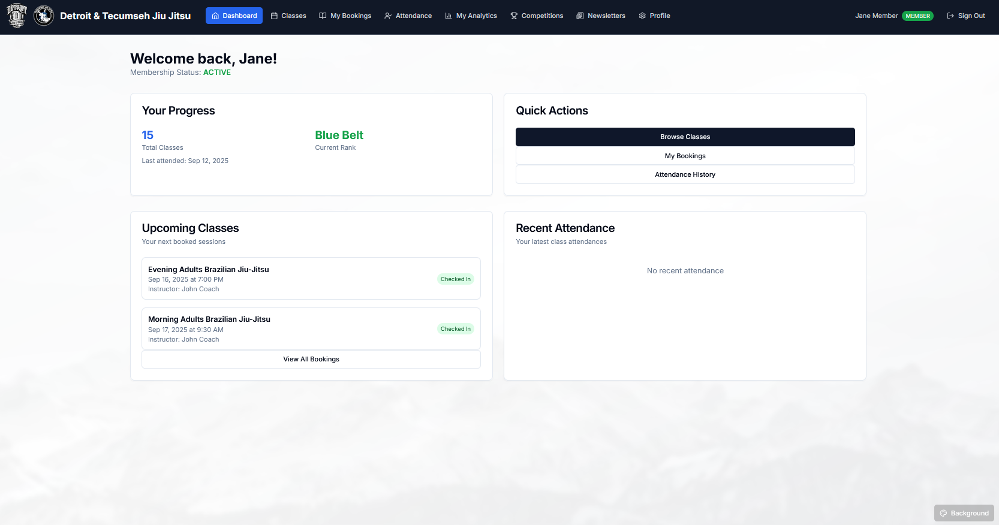
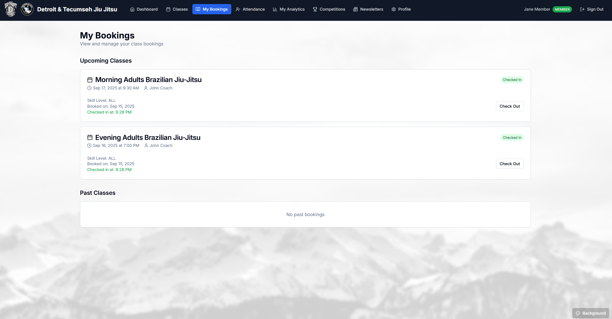
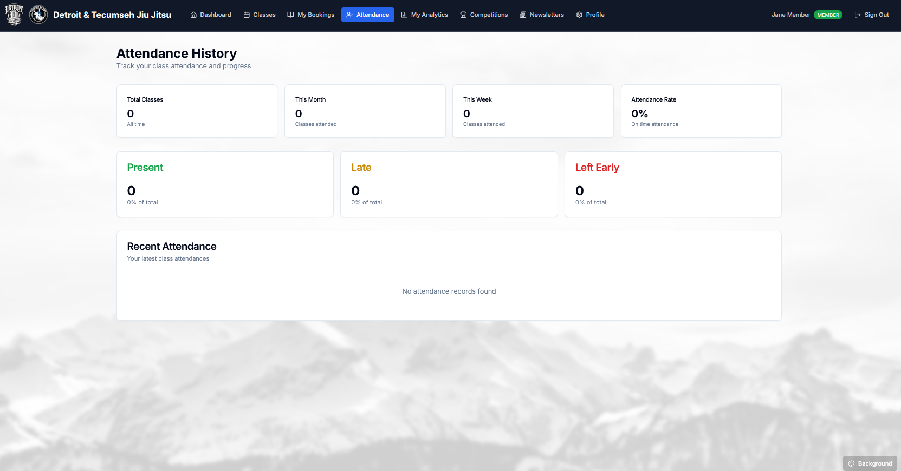
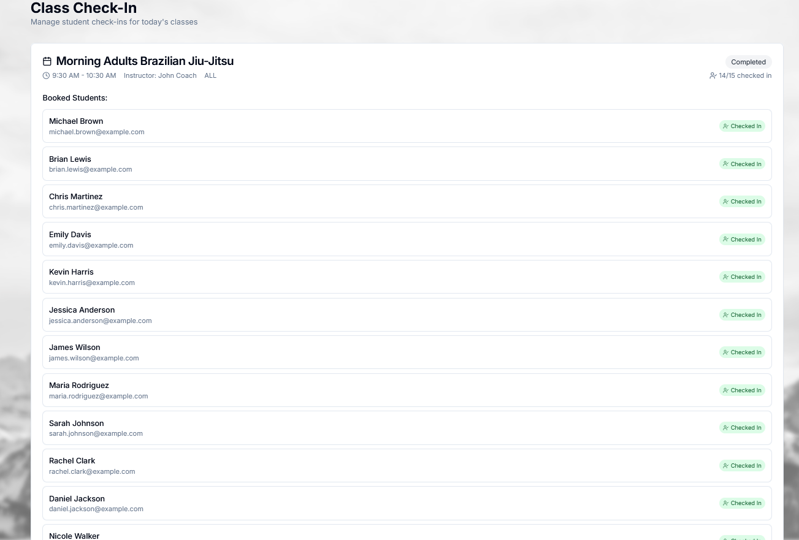
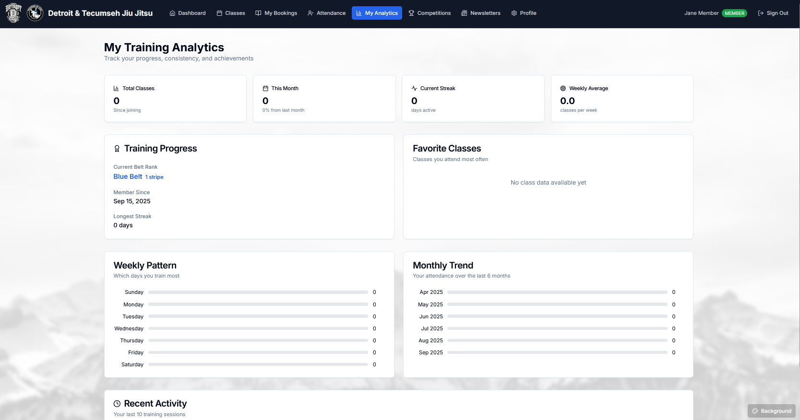
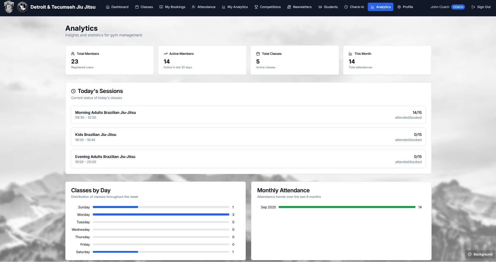
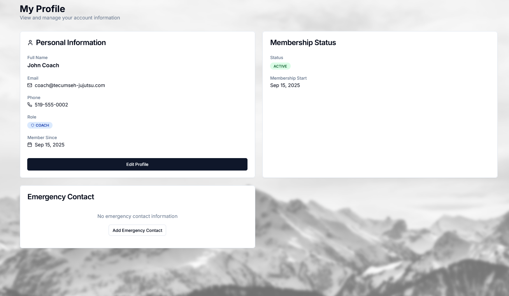

# iDoze - Website Gallery

A visual showcase of the Tecumseh Jujutsu Management System interface and features.

## 🏠 Dashboard & Navigation

### Member Dashboard

*The main member dashboard showing personal progress, upcoming classes, and quick actions. Features belt rank tracking, attendance history, and easy access to class booking.*

## 📚 Class Management

### Class Browsing

*Class listing page showing available classes with skill levels, schedules, and real-time availability. Members can book classes directly with available spot counts.*

### Booking System

*Class booking interface showing session details, instructor information, and booking confirmation flow.*

### Attendance History

*Comprehensive attendance tracking showing member participation history, class completion rates, and progress over time.*

### Attendance Tracking

*Comprehensive attendance tracking showing historical records, patterns, and member participation statistics.*

## 📊 Analytics & Reports

### My Analytics

*Personal analytics dashboard showing individual progress metrics, attendance patterns, and achievement tracking for members.*

### Profile

*User profile management interface where members can view and edit their personal information, emergency contacts, and account settings.*

### Coach Analytics

*Analytics dashboard specifically designed for instructors to track their class performance, student progress, and teaching metrics.*

## 🔐 Authentication

### Log In Home Page

*Landing page with authentication interface allowing users to sign in to access their personalized dashboard and features.*

### Sign In Page

*User authentication page where members enter their credentials to access the system and their personal dashboard.*

## 🏆 Competitions & Events

### Competitions

*Competition management interface for viewing and registering for upcoming tournaments and martial arts events.*

## 👨‍🏫 Coach Dashboard

### Coach Dashboard

*Instructor dashboard providing tools for class management, student tracking, and coaching administrative functions.*

## 👥 Student Management

### Student Management

*Comprehensive student management interface for administrators to oversee member records, enrollment, and academic progress.*

### Promote Student

*Student promotion interface allowing instructors to advance members through belt ranks with proper documentation and tracking.*

## 📧 Communication

### Newsletters

*Newsletter management system for creating and distributing gym announcements, updates, and important communications to members.*

## 👤 Profile Management

### User Profile

*Personal profile management where users can update their information, emergency contacts, and account settings.*

### Emergency Contacts

*Emergency contact management interface ensuring student safety with up-to-date contact information.*

### Edit Profile

*Profile editing interface where users can update their personal information, contact details, and account preferences.*

## 🎨 Design Features

- **Dual Branding**: Detroit & Tecumseh Jiu Jitsu logos
- **Custom Backgrounds**: Mountain landscapes, rainy atmospherics, and gradient themes
- **Role-Based Interface**: Different views for Members, Coaches, and Admins
- **Responsive Design**: Optimized for desktop and mobile devices
- **Dark Theme**: Professional martial arts aesthetic
- **Background Customization**: Users can select from preset backgrounds or upload custom images

## 🔧 Technical Features

- **Real-time Updates**: Live class availability and booking status
- **Advanced Search**: Quick filtering across all data sets
- **Export Capabilities**: Data export for reporting and analysis
- **Automated Notifications**: Email/SMS alerts for important events
- **Progress Tracking**: Comprehensive belt rank and attendance monitoring
- **Multi-role Access**: Secure role-based permissions system

## 📱 User Experience

The interface prioritizes ease of use with intuitive navigation, clear visual hierarchy, and efficient workflows. Each screen is designed to minimize clicks while maximizing functionality, ensuring both new and experienced users can quickly accomplish their tasks.

---

*All screenshots captured from the live development environment showcasing the complete feature set of the iDoze Jujutsu Management System.*