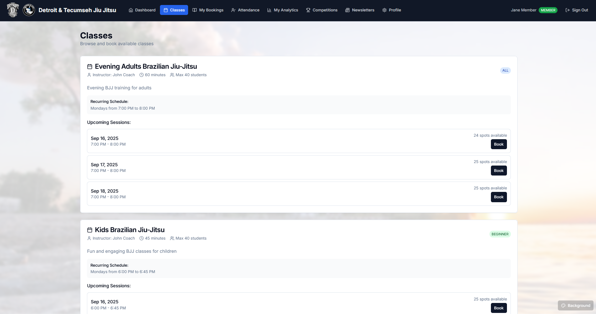
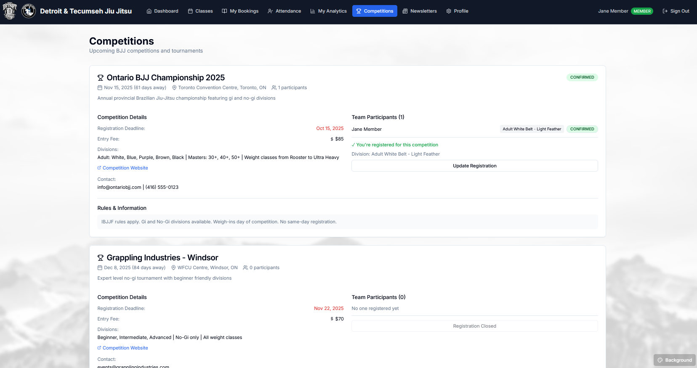
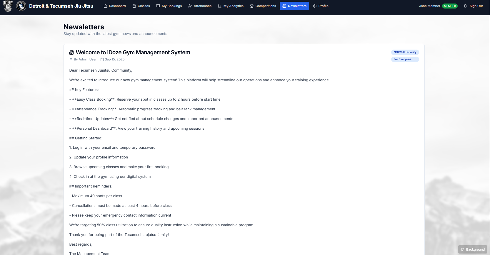
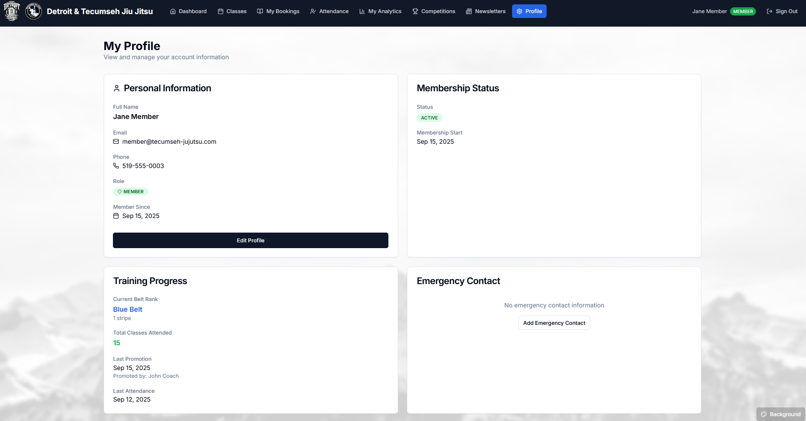
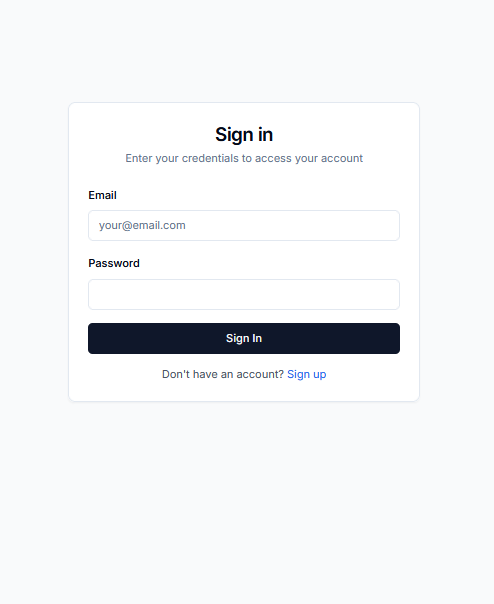
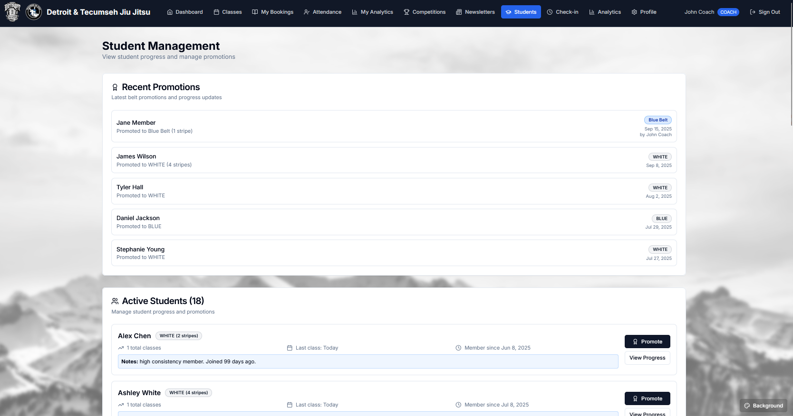
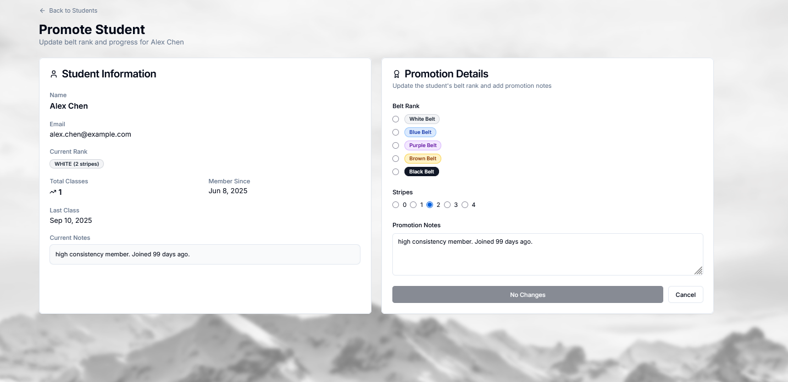
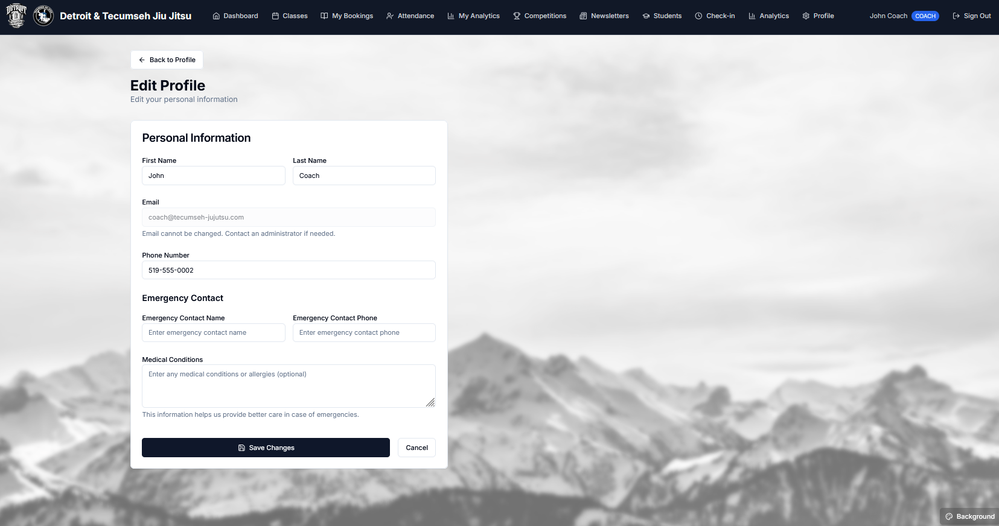

# iDoze - Website Gallery

A visual showcase of the Tecumseh Jujutsu Management System interface and features.

## 🏠 Dashboard & Navigation

### Member Dashboard

*The main member dashboard showing personal progress, upcoming classes, and quick actions. Features belt rank tracking, attendance history, and easy access to class booking.*

## 📚 Class Management

### Class Browsing

*Class listing page showing available classes with skill levels, schedules, and real-time availability. Members can book classes directly with available spot counts.*

### Booking System

*Class booking interface showing session details, instructor information, and booking confirmation flow.*

### My Bookings

*Personal booking management page where members can view upcoming classes, check-in status, and manage their reservations.*

## 👥 Student Management

### Student Directory

*Comprehensive student listing with search functionality, belt ranks, and member status. Admins can manage all student records from this interface.*

### Student Profile

*Detailed student profile page showing personal information, progress tracking, and account management options.*

### Belt Promotion

*Belt promotion interface allowing instructors to advance students through belt ranks with proper tracking and documentation.*

## 📊 Analytics & Reports

### Analytics Dashboard

*Comprehensive analytics dashboard showing key metrics, class utilization, and business insights for gym management.*

### Detailed Analytics

*In-depth analytics with charts and graphs showing attendance patterns, member engagement, and performance metrics.*

## 🏆 Competition Management

### Competition Registration

*Competition management interface for organizing tournaments and tracking participant registrations.*

### Competition Dashboard

*Main competition dashboard showing upcoming events, participant lists, and competition management tools.*

## ✅ Attendance Tracking

### Check-in System

*Streamlined check-in system for coaches to mark student attendance during classes with quick search and selection.*

### Attendance History

*Comprehensive attendance tracking showing historical records, patterns, and member participation statistics.*

## 📧 Communication

### Newsletter System

*Newsletter creation and management system for gym-wide communications and announcements.*

### Newsletter Archive

*Archive of published newsletters with easy access to past communications and announcements.*

## 👤 Profile Management

### User Profile

*Personal profile management where users can update their information, emergency contacts, and account settings.*

### Emergency Contacts

*Emergency contact management interface ensuring student safety with up-to-date contact information.*

### Background Customization

*Custom background selection feature allowing users to personalize their dashboard experience with preset images or custom uploads.*

## 🎨 Design Features

- **Dual Branding**: Detroit & Tecumseh Jiu Jitsu logos
- **Custom Backgrounds**: Mountain landscapes, rainy atmospherics, and gradient themes
- **Role-Based Interface**: Different views for Members, Coaches, and Admins
- **Responsive Design**: Optimized for desktop and mobile devices
- **Dark Theme**: Professional martial arts aesthetic
- **Background Customization**: Users can select from preset backgrounds or upload custom images

## 🔧 Technical Features

- **Real-time Updates**: Live class availability and booking status
- **Advanced Search**: Quick filtering across all data sets
- **Export Capabilities**: Data export for reporting and analysis
- **Automated Notifications**: Email/SMS alerts for important events
- **Progress Tracking**: Comprehensive belt rank and attendance monitoring
- **Multi-role Access**: Secure role-based permissions system

## 📱 User Experience

The interface prioritizes ease of use with intuitive navigation, clear visual hierarchy, and efficient workflows. Each screen is designed to minimize clicks while maximizing functionality, ensuring both new and experienced users can quickly accomplish their tasks.

---

*All screenshots captured from the live development environment showcasing the complete feature set of the iDoze Jujutsu Management System.*